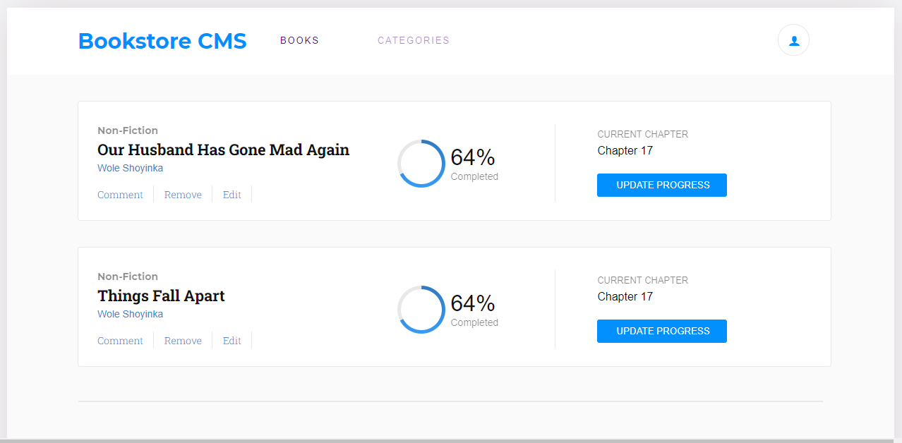

# Bookstore
The Bookstore is a that allows user to:

- Display a list of books.
- Add a book.
- Remove a selected book.

This project was bootstrapped with [Create React App](https://github.com/facebook/create-react-app).

## Built With

- HTML
- CSS
- JavaScript
- Redux

## Application Page url

## Getting Started

> To get a local copy follow the following steps:

- Copy this link https://github.com/phelian23/bookstore.git
- Open your terminal or command line
- Run git clone and paste the link
- Open the folder with your code editor
- Create a branch to work on
- run npm start

## Authors

👤 **Phelian23**

- GitHub: [@phelian23](https://github.com/phelian23)

## 🤝 Contributing

Contributions, issues, and feature requests are welcome!

Feel free to check the [issues page](../../issues/).

## Show your support

Give a ⭐️ if you like this project!

## Acknowledgments

- Hat tip to anyone whose code was used
- Inspiration
- etc
